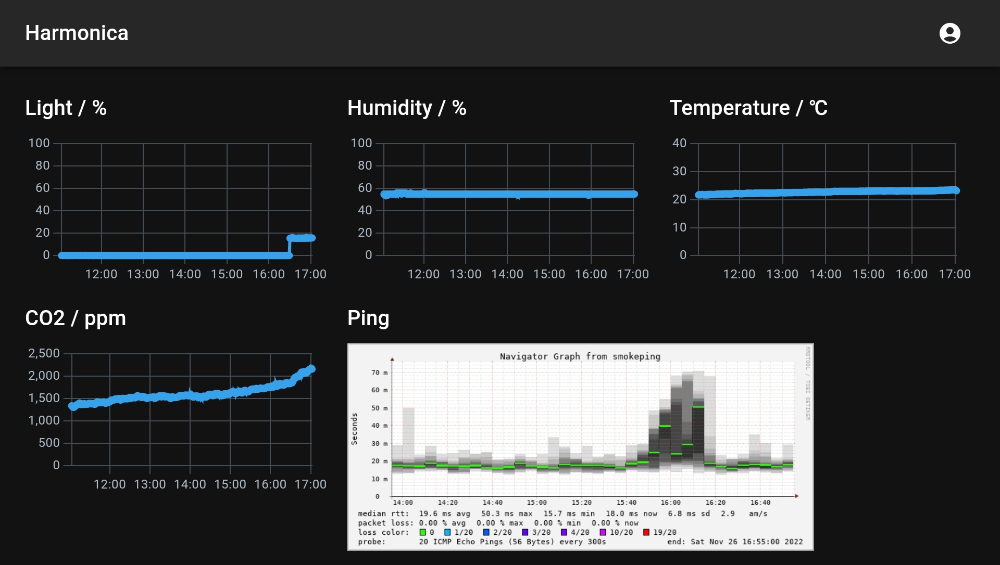

# harmonica-web-next

自宅センサモニターHarmonicaのNext.js製Webフロントエンドアプリ。



## Development Environment

- Node 18
- npm 8
- (Recommended) nvm: <https://github.com/nvm-sh/nvm>

## Run the development server

```shell
nvm use

npm ci
```

Create `.env.local` file.

```env
NEXT_PUBLIC_HASURA_URL=https://hasura.example.com
HASURA_ADMIN_SECRET=myadminsecretkey

NEXT_PUBLIC_SMOKEPING_URLS=https://smokeping.example.com
NEXT_PUBLIC_SMOKEPING_TARGETS=MyGroup.MyTarget
```

```shell
npm run codegen -- --watch

npm run dev
```

## Deployment

```shell
nvm use

npm ci

npm run build

rsync -av --delete out/ /path/to/
```
